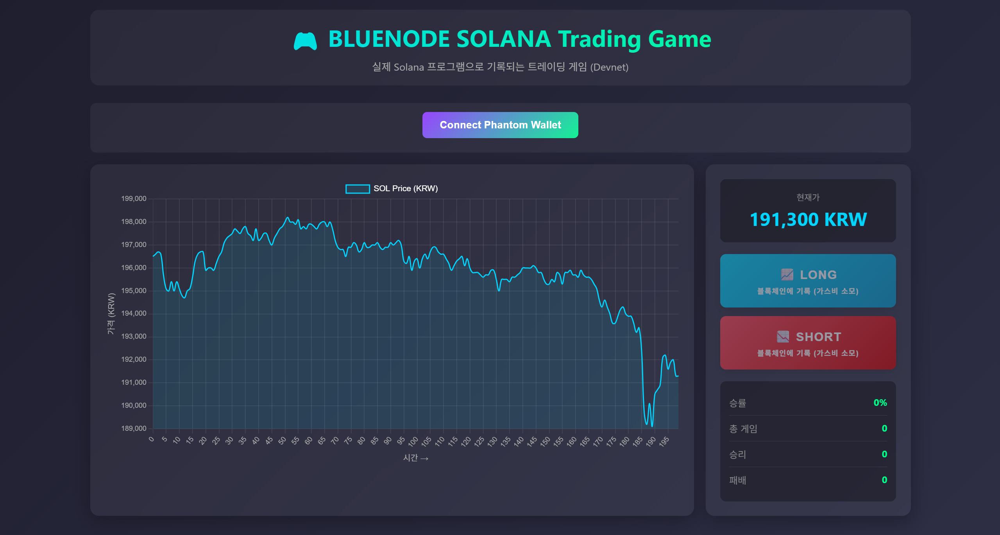
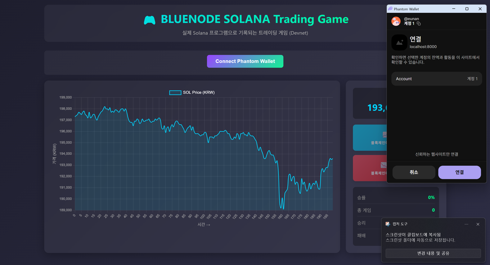
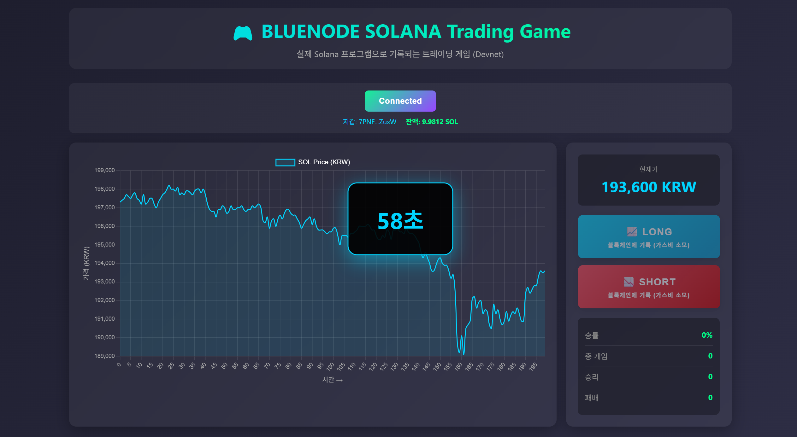
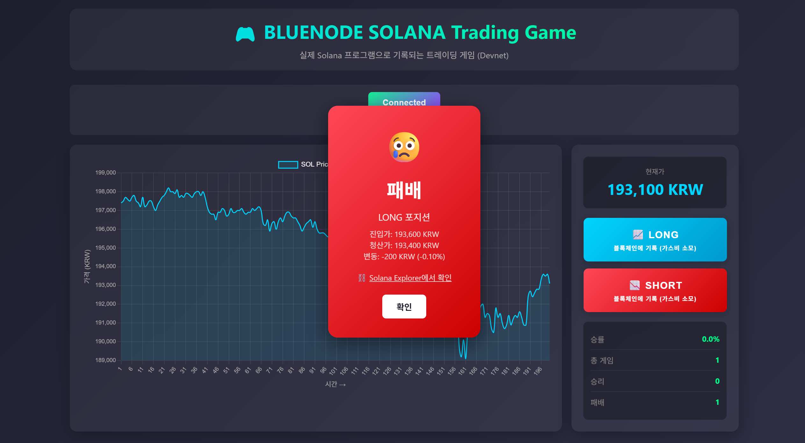

# 🎮 BLUENODE_Solana Short/Long Trading Game


**BLUENODE**에서 **BLUE_Sola Hackathon**을 위해 개발된 실시간 가격 예측 게임입니다.
**Solana Testnet** 환경에서 동작하며, **FastAPI**를 통해 실시간 데이터를 처리합니다. 사용자는 1분 뒤의 가격 등락을 예측하고, 모든 게임 결과는 투명하게 솔라나 블록체인(On-Chain)에 기록됩니다.



---

## ⚠️ 필독: 플레이 전 설정 (Setup)

이 게임은 **Solana Testnet** 환경에서 동작합니다. 정상적인 플레이를 위해 반드시 아래 절차를 따라주세요.

### 1. 지갑 네트워크 변경
Phantom 지갑 설정에서 네트워크를 **Testnet**(또는 Devnet)으로 변경해야 합니다.
> *설정(Settings) -> 개발자 설정(Developer Settings) -> 네트워크 변경(Change Network) -> **Testnet***

### 2. SOL 에어드랍 받기 (가스비)
트랜잭션 가스비 지불을 위해 테스트넷 SOL이 필요합니다.
* **방법 A:** 터미널 명령어 사용 `solana airdrop 1`
* **방법 B:** [Solana Faucet](https://faucet.solana.com/) 웹사이트 방문

---

## 🕹️ 플레이 방법 (How to Play)

### 1. 지갑 연결 (Connect Wallet)
우측 상단의 `Connect Phantom Wallet` 버튼을 클릭하여 지갑을 연결합니다.
(※ 연결 시 Testnet 환경인지 확인하는 팝업이 뜹니다.)



### 2. 포지션 예측 (Predict)
실시간 차트를 분석하여 1분 뒤 가격의 방향을 예측하고 버튼을 클릭합니다.
* **📈 LONG:** 가격 상승 예상
* **📉 SHORT:** 가격 하락 예상

### 3. 대기 (Wait)
포지션 진입 시 트랜잭션이 발생하며, 승인 후 **60초 타이머**가 작동합니다.



### 4. 결과 확인 (Result)
1분이 지나면 자동으로 종료 트랜잭션이 발생하며 승패 결과가 팝업으로 표시됩니다.
하단의 링크를 클릭하면 **Solana Explorer**에서 기록된 데이터를 즉시 확인할 수 있습니다.



---

## 🛠️ 기술 스택 (Tech Stack)

* **Blockchain:** Solana Testnet (Anchor Framework 사용)
* **Backend:** Python **FastAPI** (가격 데이터 집계 및 API 서버)
* **Frontend:** Vanilla JS, Chart.js (No-Build 환경, HTML/JS 네이티브 구현)
* **Wallet:** Phantom Wallet 연동

---

## 🚀 설치 및 실행 (Installation)

### 1. 레포지토리 클론
```bash
git clone [https://github.com/okjimin321/BLUE_GAME.git](https://github.com/okjimin321/BLUE_GAME.git)
cd BLUE_GAME
